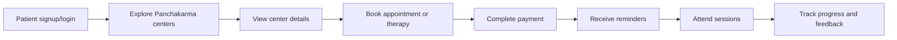
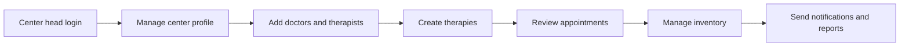
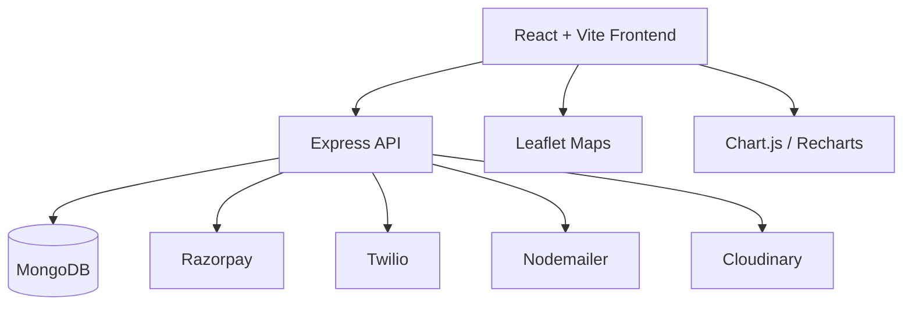

# AyurSutra

AyurSutra is a Smart India Hackathon finalist project for digitizing Panchakarma care. It connects patients, Panchakarma center admins, doctors, and super admins in one workflow for center discovery, appointment booking, therapy scheduling, treatment tracking, feedback, notifications, pharmacovigilance reporting, and payments.

Built for the SIH final round, the project focuses on a real healthcare operations problem: Panchakarma centers need a reliable digital system for appointments, therapy planning, patient follow-ups, progress monitoring, and center administration. AyurSutra presents this as a full-stack MERN platform with role-based dashboards and practical integrations for maps, OTP communication, payments, reports, and wellness analytics.

[](https://react.dev/)
[](https://vite.dev/)
[](https://nodejs.org/)
[](https://www.mongodb.com/)
[](LICENSE)

## Live Links

- Website: https://ayursutra.online/
- Backend: https://ayursutra-6l5i.onrender.com/
- AI assistant: https://sih-ayursutra-t1ci.onrender.com/chat
- Blogs: https://blogs.ayursutra.online/
- Shop: https://shop.ayursutra.online/
- GitHub: https://github.com/samshete05/AyurSutra-SIH
- LinkedIn project update 1: https://www.linkedin.com/feed/update/urn:li:activity:7486082793291087874/
- LinkedIn project update 2: https://www.linkedin.com/feed/update/urn:li:activity:7486082193400729600/
- LinkedIn project update 3: https://www.linkedin.com/feed/update/urn:li:activity:7486076851782733826/

## Repository Note

The original working repository path is no longer used. This repository is the updated and maintained project path for the final AyurSutra SIH submission.

## Preview

| Landing experience | Progress tracking | Center discovery |
| --- | --- | --- |
|  |  |  |

## Problem Statement

Panchakarma centers often manage appointments, therapy rooms, therapists, patient instructions, progress notes, and follow-ups across paper records, phone calls, and separate tools. This creates delays, missed reminders, poor visibility for doctors, and fragmented patient histories.

AyurSutra brings these operations into a single role-based platform designed specifically for Panchakarma workflows.

## Key Features

- Role-based dashboards for patients, doctors, Panchakarma center heads, and super admins.
- Patient onboarding with OTP verification and secure JWT-based sessions.
- Center discovery with maps, center details, doctors, therapists, therapies, and availability.
- General appointment and therapy appointment booking with multi-step patient flow.
- Razorpay payment order creation and payment verification.
- Doctor dashboard for appointment review, patient details, feedback, and follow-up management.
- Center admin dashboard for appointments, doctors, therapists, therapies, inventory, notifications, and center profile.
- Patient dashboard for appointments, treatments, therapy progress, wellness metrics, reminders, feedback, and profile settings.
- Progress analytics using charts for symptoms, mood, water, sleep, activity, medication, therapy progress, and wellness trends.
- Pharmacovigilance reporting for adverse drug reaction tracking.
- NFC feature page for quick patient card access.
- AI recommendation page linked to the AyurSutra assistant.
- Email/SMS notification support using Nodemailer and Twilio integrations.

## User Roles

| Role | Main Capabilities |
| --- | --- |
| Patient | Sign up/login, discover centers, book appointments, view treatments, track progress, submit feedback, receive notifications |
| Doctor | Login, view assigned appointments, inspect patient details, add notes, manage follow-ups |
| Center Head | Manage center profile, doctors, therapists, therapies, appointments, inventory, notifications, and reports |
| Super Admin | Monitor platform-level activity, users, centers, and system reports |

## User Flows

### Patient Journey



### Center Operations



### System Architecture



## Tech Stack

### Frontend

- React 19
- Vite
- React Router
- Tailwind CSS
- Axios
- Leaflet and React Leaflet
- Chart.js, React Chart.js 2, and Recharts
- Framer Motion
- Lucide React and Font Awesome
- React Toastify
- i18next
- jsPDF

### Backend

- Node.js
- Express 5
- MongoDB with Mongoose
- JWT authentication
- bcrypt password hashing
- cookie-parser and CORS
- Razorpay payments
- Twilio SMS
- Nodemailer email
- Cloudinary media storage
- Multer file uploads
- Zod validation

## Folder Structure

```text
AyurSutra-Final/
+-- backend/
|   +-- db/
|   +-- jobs/
|   +-- models/
|   +-- otplogic/
|   +-- router/
|   +-- utils/
|   +-- index.js
|   +-- package.json
+-- frontend/
|   +-- public/
|   +-- src/
|   |   +-- assets/
|   |   +-- components/
|   |   +-- context/
|   |   +-- data/
|   |   +-- layouts/
|   |   +-- pages/
|   |   +-- router/
|   +-- package.json
+-- LICENSE
+-- README.md
```

## API Modules

| Module | Base Route | Purpose |
| --- | --- | --- |
| Patient | `/patient` | Auth, appointments, profiles, progress, notifications, center discovery |
| Progress | `/patient` | Health metrics, therapy progress, wellness tracking |
| Doctor | `/doctor` | Doctor auth and doctor-side workflows |
| Doctor Dashboard | `/doctor-dashboard` | Appointment and dashboard operations |
| Follow-ups | `/followups` | Follow-up scheduling and tracking |
| Center Admin | `/PanchKarmaCenter` | Center, doctor, therapist, therapy, inventory, reporting |
| Payments | `/payments` | Razorpay order creation and verification |
| ADR Reports | `/api` | Pharmacovigilance reporting module |

## Getting Started

### Prerequisites

- Node.js 18 or newer
- npm
- MongoDB database
- Razorpay account for payments
- Twilio account for SMS OTP/reminders
- Cloudinary account for uploads
- Email account or SMTP provider for emails

### Backend Setup

```bash
cd backend
npm install
npm run dev
```

The backend starts on:

```text
http://localhost:3000
```

Create `backend/.env` with these values:

```env
MONGO_URL=
JWT_KEY=

TWILIO_SID=
TWILIO_AUTH=
TWILIO_NUMBER=

RAZORPAY_KEY_ID=
RAZORPAY_KEY_SECRET=

CLOUDINARY_NAME=
CLOUDINARY_KEY=
CLOUDINARY_SECRET=

HOST=
SERVICE=
EMAIL_PORT=
SECURE=
USER=
PASS=

EMAIL_USER=
EMAIL_PASS=
```

### Frontend Setup

```bash
cd frontend
npm install
npm run dev
```

The frontend starts on:

```text
http://localhost:5173
```

Create `frontend/.env` with:

```env
VITE_API_URL=http://localhost:3000
```

## Important Routes

| Route | Screen |
| --- | --- |
| `/` | Home |
| `/signup` | User registration |
| `/login` | User login |
| `/allcenters` | Panchakarma center list |
| `/center/:slug/:centerId` | Center details |
| `/patient` | Patient dashboard |
| `/patient/appointments` | Patient appointments |
| `/patient/find-centers` | Center discovery |
| `/patient/progress` | Patient progress |
| `/doctor-dashboard` | Doctor dashboard |
| `/dashboard` | Center head dashboard |
| `/center-appointments` | Center appointments |
| `/inventory` | Center inventory |
| `/pharmaco-reporting` | Pharmacovigilance reporting |
| `/super-admin-dashboard` | Super admin dashboard |
| `/nfc-card-at-ayursutra` | NFC card feature |

## Resume Highlights

- Built a full-stack healthcare workflow platform for Panchakarma centers.
- Presented AyurSutra as a Smart India Hackathon finalist solution for digitizing Panchakarma patient management and therapy scheduling.
- Implemented multi-role authentication and protected routing for patients, doctors, center heads, and super admins.
- Designed end-to-end appointment, therapy scheduling, payment, progress tracking, and feedback workflows.
- Integrated third-party services including Razorpay, Twilio, Cloudinary, Nodemailer, maps, and charting libraries.
- Created dashboards with real-time operational views for patients, doctors, and center admins.

## Security Notes

- Keep `.env` files private and never commit real API keys, database URLs, OTP credentials, or payment secrets.
- Rotate credentials immediately if they were ever pushed to a public repository.
- Use different credentials for local development and production deployment.

## Author

**Samiksha Shete**

- GitHub: https://github.com/samshete05
- LinkedIn posts:
  - https://www.linkedin.com/feed/update/urn:li:activity:7486082793291087874/
  - https://www.linkedin.com/feed/update/urn:li:activity:7486082193400729600/
  - https://www.linkedin.com/feed/update/urn:li:activity:7486076851782733826/

## License

This project is licensed under the MIT License. See [LICENSE](LICENSE) for details.
